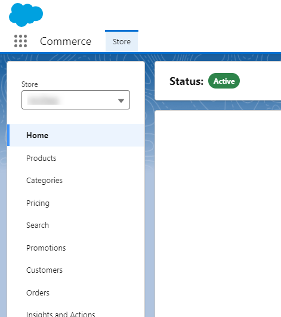

# D2C Store project

This repository is intended to help with some necessary procedures to easily create a D2C Lighthing scratch, developer, sandbox or even a production organization environment, of course, respecting some necessary steps, licenses and configurations to achieve that.

To use this guidance, we are expecting that you are comfortable with:
* [Salesforce DX](https://trailhead.salesforce.com/content/learn/projects/quick-start-salesforce-dx) ;
* [Salesforce CLI features](https://developer.salesforce.com/tools/sfdxcli), and;
* [Scratch Orgs](https://developer.salesforce.com/docs/atlas.en-us.sfdx_dev.meta/sfdx_dev/sfdx_dev_scratch_orgs.htm);
* [Git CLI](https://git-scm.com/book/en/v2/Getting-Started-The-Command-Line);

## The summary (spoiler alert)

Let's summarize what we'll do:
1. Check the [local environment requirements](#first-things-first-local-environment);
1. Update your [community list](#community-list-update) if needed;
1. Take a look at the [main idea](#the-main-idea) and enable your ["dev hub" organization](#enable-your-dev-hub-organization) if needed;
1. [Create your Scratch organization](#create-your-scratch-organization) in [windows environment](#windows-environment) or [not](#no-windows-environment);
1. [Enable the new commerce app](#refreshed-commerce-app);
1. [Do the CMS configuration](#-cms-configuration);
1. [Relate the CMS images with the products](#product-and-image-relationship);
1. Activate the [User Access Policies](#user-access-policies);
1. Finish the [guest user access](#guest-user-access) final steps;
1. Configure the additional [self registration](#additional-self-registration-settings) settings;

Well, few thing to do :sweat_smile: isn't? So, let's do it!!!

## First things first: Local environment

In your workstation, you need to have at least the following softwares installed:

* Salesforce CLI
<!-- * Salesforce [SFDX Commerce Plugin](https://github.com/forcedotcom/sfdx-1commerce-plugin) -->
* Visual Studio Code with the plugins below:
    * GitLens;
    * Salesforce Extension Pack;
    * Salesforce CLI Integration;
    * Salesforce Package.xml Generator Extension for VS Code;
    * SF Package.xml Formatter Extension for VS Code;

<!-- 
## CI/CD Process

Let's agree, a successful project needs to follow some successful strategies, like a simple CI/CD process you can see on this video:

[](https://youtu.be/oqccLAu8Axw)

### Kindly reminder - A summary about it

After understand all the things shown in our previous video related with CI/CD process, and also available on that repository, you need to remember these steps for all development process:

1. Get a ticket to work (DEV-123);
1. Create the branch based on develop branch and name it based on the ticket - feature/DEV-123;
1. Work in that feature on your scratch org (creation details below);
1. Create the manifest file (based on the ticket) to move through environments - manifest/package-DEV-123.xml
1. Commit your changes
    ```
    git commit -am "DEV-123 Something related with your work"
    ```    
1. Push and create a pull request to develop branch (add your TL as reviewer);
    * The title needs to be also based on the ticket: DEV-123 Something useful;
    
    * That will trigger the action to just validate the deployment;
    * If the deployment not perform well or the TL ask for adjustment you get back to the step 3;
    * If everything is fine, the TL can approve and merge, triggering the real deployment on CI environment;
1. You test your changes on CI environment;
    * If you find out any problems, you need to get back to the step 3;
1. After testing successfully, create a pull request to QA branch (add your TL as reviewer);
    * Add in the pull request an evidence about your amazing work;
    
    * If the deployment not perform well or the TL ask for adjustment you get back to the step 3;
    * If everything is fine, the TL can approve and merge, triggering the real deployment on QA environment; 
-->

## Setup

### Community List update

Before go ahead, on your terminal,  you need to run the command below to update the community list templates:
```
sf community list
```

After executing that, just hit enter button to update the necessary plugin:


The total result could be different, but there is no problem!


### The main idea

The scripts will be executed in the "bash terminal", and we strongly recommend you to take a look on the video demonstration below:

* Scratch org and Storefront creation

    [](https://www.youtube.com/channel/UCn4eRGgTiZLz1rb2qXLfjew)

On that video, you'll see a demonstration regarding the things we'll explain here!


All deployments and configurations will be applied in your local **default organization**.
To get sure about which is yours, please run the command below:

    sf org list --all
    


* The "D" sign shows your devHub org;
* The "U" sign shows your *local default organization* (in that one the things will be implemented);

So, with that explained, let's get down to business!

### Enable your "dev hub" organization

That is one shot action, forever... I meant, you don't need to do that over again.

Just run this command on your terminal:

```
sf org login web --set-default-dev-hub --alias YOUR_DEV_HUB_ALIAS

```

In the browser that will open, you need to fill out the information with your options


Allow the access if asked:


And be happy forever


### Create your Scratch organization 

All scripts here were developed to run on "bash" terminal, no matter in what operation system you are.

#### No windows environment

Let's create the scratch org and configure the store front.

* ./scripts/bash/1-createScratchDigitalExpSetupStore.sh [YOUR_SCRATCH_NAME_HERE] [YOUR_SHOP_NAME_HERE] [TEMPLATE_TYPE] [WINDOWS_ENVIRONMENT]
* Example: 
    ```
    ./scripts/bash/1-createScratchDigitalExpSetupStore.sh tmpScrach d2cLightning D2C No
    ```
    
After some executions, the script will stop and will tell you to upload the CMS images, to have the same look and feel you have on our example:


[See the CMS configuration](#cms-configuration) section, to do this images uploading, and after you have done that, you can press enter to continue the storefront deployment, with almost the same look and feel.

That will do all the configuration needed to achieve:
* Create the scratch org;
* Create the digital experience;
* Create the store front (with sample products, buyer group, entitlement policy, etc);
* Configure the current variations;
* Deploy the current digital experience look and feel;


#### Windows environment

To do that on windows environment, a lot of times you can face an error caused due the "double quotes" interpretation...
So you'll need to do more steps than you need when are not in windows environments.
The command line is almost the same, just changing the las parameter:

* Example: 
    ```
    ./scripts/bash/1-createScratchDigitalExpSetupStore.sh tmpWork d2cLightning D2C Yes
    ```
After executing the scratch org creation, and the first setup, the script will stop and ask you **"if that is the second time you are seeing that message"**...


And you'll answer no **N** 


At this point, the script will stop, and tell you to run a command on "Power Shell" terminal (1):


After doing that, you get back on bash terminal run the other command to continue (2).

The script will stop on the same place before, but now, is the second time you are seeing this message, so, you'll answer **"Y"**


And the process will continue exactly in the same way for no windows environmet.

Due to that, the same way you have in [No windows environment](#no-windows-environment), after some executions, the script will stop and will tell you to upload the CMS images, so [see the CMS configuration](#cms-configuration), and continue doing the job.

<!-- 
### Data loading

The data loading up to here (categories, products, etc) is just based on the samples... 
But we already have an useful template in hour [CSV folder](./scripts/csv/b2bAccDesaProductVariationColorSize.csv), that you can upload as [shown in sample](https://wearesolu.atlassian.net/wiki/spaces/SFP/pages/147128339/Sample+videos) 


After do this upload, to remove the products that don't have related variations, just run the commands below in the Developer Console:

1. Delete the products

    SELECT Id, Name 
    FROM Product2 
    WHERE ProductClass = 'VariationParent'
    AND   Id NOT IN (SELECT VariantParentId FROM ProductAttribute)

And delete the results


2. Delete orphan product category relation ship

    SELECT Id, Name, ProductCategoryId, ProductId, CatalogId, ProductToCategory 
    FROM ProductCategoryProduct
    WHERE ProductId NOT IN (SELECT Id FROM Product2 )

And delete the results

## Manual steps

-->

### Refreshed Commerce App

With great releases, come great responsibilities.

As you should know, in the "[Summer ’24 Release Notes](https://help.salesforce.com/s/articleView?id=release-notes.rn_comm_new_app.htm&release=250&type=5)" Salesforce is mentioning about the new "Commerce App".

What you probably don't know, is that feature is not activatable [through the metadata yet](https://developer.salesforce.com/docs/atlas.en-us.api_meta.meta/api_meta/meta_commercesettings.htm).

In old orgs, both commerce app versions will exists, but guess what? You'll not have the previous version on new organizations anymore, including the scratch org.

As you can't configure that through the metadata, you need to activate that manually on your scratch org.

1. Setup > Commerce > Settings;
1. Toggle the Enable App;
1. Save;


After that, the app will be available:



### CMS configuration

Ok, to be able to do anything here, first you need to [activate the new commerce app](#refreshed-commerce-app), so, if you have not done that yet, please, go there and get back here...

In this current version, we are creating the D2C Commerce (former B2B2C Lightning) in a scratch organization, and uploading [some products to there](scripts/json/Product2s.json).

Nevertheless, that upload doesn't put some pretty images there... for now, to achieve that, we'll perform the manual steps below...

1. Access the CMS tab (Store > Content Management)

    

1. Edit the current CMS Workspace name (clique on edit in the row)

    

    To have the scripts really running fine, follow the name convention bellow

    * [YOUR_STORE_NAME] Workspace

        

1. Import the media to looks pretty

    Here we'll use [this example file](./scripts/json/productMedia.zip) that folows the new CMS structure.

    * Click on import content
    
        
        
    * Select the file
    
        
    * Check the "Publish content after import" option and import

        

    It will take some seconds... but you'll receive an email when it has finished, then refresh your workspace and check the images there:
        


### Product and image relationship

1. With the images and the products there, you'll run the script bellow, to put the things together:
    * ./scripts/bash/6-importProductMedia.sh [YOUR_SHOP_NAME_HERE]
    * Example:
        ```
        ./scripts/bash/6-importProductMedia.sh d2cLightning
        ```

        

1. Now you can see your produts related with the CMS images:

    

1. Rebuild your search index and check the things working!

    >


### User Access Policies

Be prepared to new user management process?

Yes, we do that here!

The deployment will delivery some User Access Policies, that you'll need to enable and apply to the user created:


Specifically for D2C you just need to care about, the ones below:
* ActiveExternalShopperCommerceUser
* InactiveExternalShopperCommerceUser

Since this was not activated before, you need to enable the trigger (1), and **Apply the Policy** that to the existing user (2)


### Guest user access

With our scripst we will let you "almost there", to have the Guest navigation enabled!

And as  matter of fact, we could to do that all with the scripts, but we didn't for the following reasons:
1. Not all B2B customer will get that enabled;
1. While you are creating and changing things, you don't wanna the guests looking around, not yet;
1. This is just a guidance, not the final word!

With that said, you'll need to apply manually the final touches:
* All Sites > Digital Experiences > Workspaces > Administration > Preferences > Enable the "Allow guest users to access public APIs" option and save it:


* All Sites > Digital Experiences > Workspaces > Administration > Builder > Settings > Enable the "Guest users can see and interact with the site without logging in" option and save it:


### Additional Self Registration settings

To do that the self registration, you need to apply few additional configurations, as explained here in this [official documentation](https://help.salesforce.com/s/articleView?id=commerce.comm_self_registration.htm&type=5)


# Work in progress

So, few things done up to here...

But the idea is evolve this document with the project...

That means this is not the final say, is a work in progress... so, see you around!